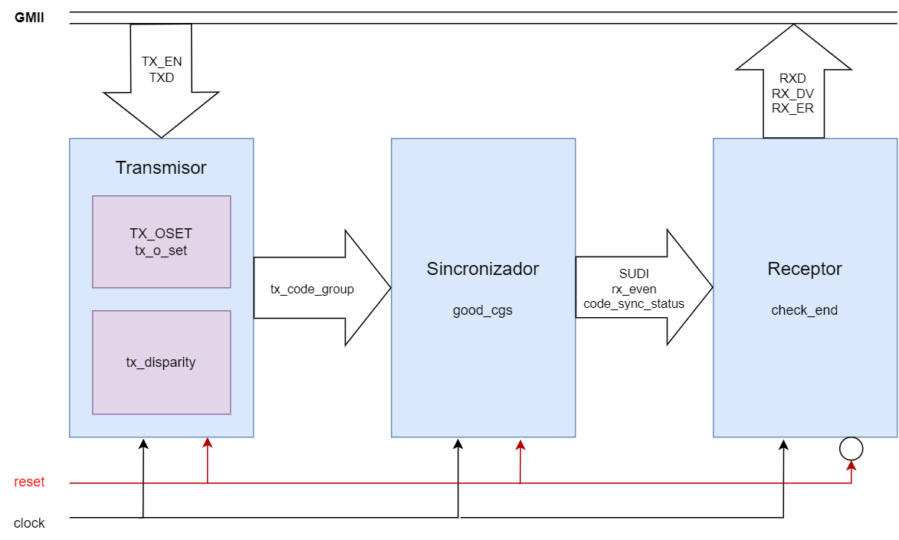
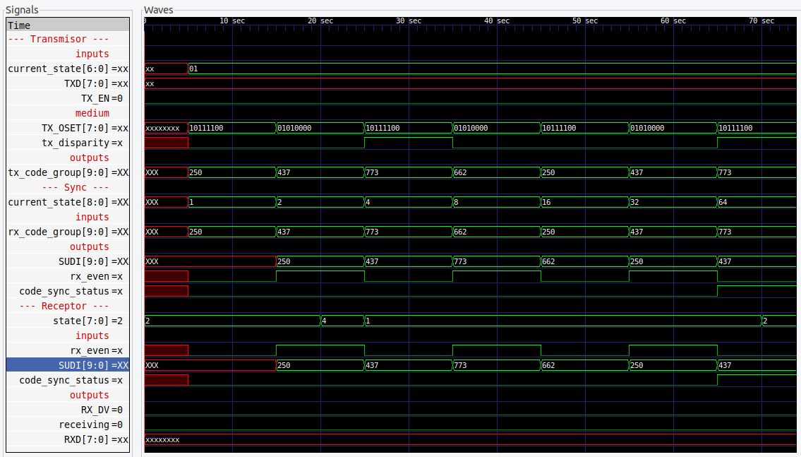
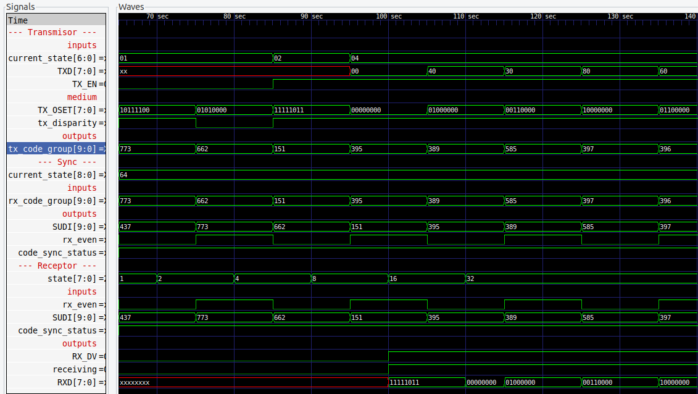
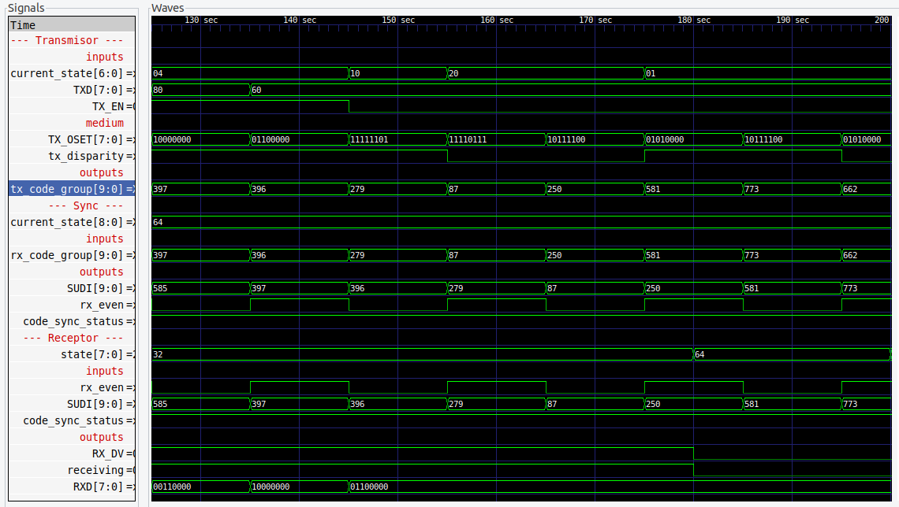
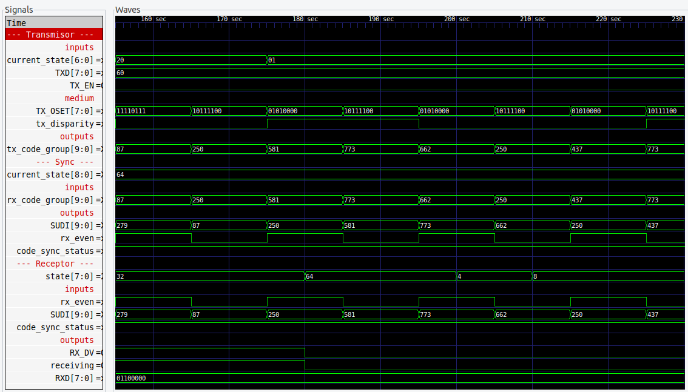

# Grupo 03

|Miembro|Módulo asignado|
|---|---|
|Gabriel Siles Chaves|Transmisor|
|Jun Hyun Yeom Song|Sincronizador|
|Jorge Loría Chaves|Receptor|

En este repositorio, se ha implementado la subcapa *Physical Code Sublayer* (PCS) del protocolo Ethernet, de acuerdo con las especificaciones de la cláusula 36.

## Instrucciones

En el main branch, se encuentra el folder *TransmitSyncRec*, el cual contiene todos los archivos necesarios para compilar la subcapa PCS.

1. Asegúrese de tener acceso a:
  * iverilog
  * gtkwave
  * make
2. Descargue el folder *TransmitSyncRec*.
3. En la termina, localícese en la dirección del folder.
4. Ejecute *make* en la línea de comandos.

Si desea ver los diagramas ASM y los resultados de cada módulo por separado, encontrará los archivos necesarios en cada branch:

* *Transmisor*
* *Sincronizador*
* *Receptor*

Los branches *SyncRec* y *TransmitSyncRec* son branches de pruebas.

## Diseño arquitectónico

  
  <h4 align="center">Diagrama de bloques de la capa PCS.</h4>

## Resultados generales

  
  <h4 align="center">Formas de onda desde el inicio de la prueba hasta la sincronización (code_sync_status = 1).</h4>

  
  <h4 align="center">Formas de onda desde la sincronización hasta recibir los cinco datos de la prueba.</h4>

Los cinco datos de prueba son:

|Código|RD|Dato (decimal)|
|---|---|---|
|D0.0|Positivo|395|
|D0.2|Positivo|389|
|D16.1|Positivo|585|
|D0.4|Positivo|397|
|D0.3|Positivo|396|

  
  <h4 align="center">Formas de onda desde el último dato hasta la secuencia /T/R/K28.5.</h4>

  
  <h4 align="center">Formas de onda en donde se generan IDLE de nuevo.</h4>

